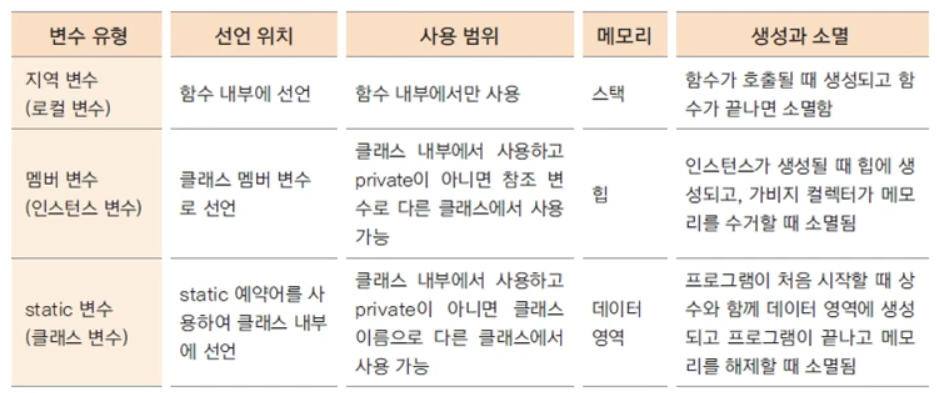

### 01. 객체와 객체지향 프로그래밍
- ### 객체
    - 구체적, 추상적 데이터 단위
    - 명사, 동작,,

- ### 객체 지향 프로그래밍 VS 절차 지향 프로그래밍
    - 절차 지향 프로그래밍
        - 시간의 흐름에 따른 프로그래밍
        - ex) C언어
    - 객체 지향 프로그래밍
        - 정의한 객체들 간의 관계를 프로그래밍
        - ex) C++, C#, Python

- ### 객체 지향 프로그램은 어떻게 구현하는가?
    - 객체 정의
        - 속성(property)
    - 각 객체가 제공하는 기능들을 구현
    - 각 객체가 제공하는 기능들 간의 소통을 통하여 객체 간의 협력을 구현

### 02. 객체를 클래스로 구현
- ### 클래스
    - 객체의 속성은 클래스의 **member variable**로 선언함.
        - member variable은 객체 생성시 초기화 됨
    - 속성을 추상화 해서 구현 함
    - 객체의 역할은 **method**로 구현

### 03. 함수와 메서드
- ### 함수
    - 하나의 기능을 수행하는 일련의 코드
    - 구현된 함수는 호출하여사용하고 호출된 함수는 기능이 끝나면 제어가 반환됨.

- ### 함수 호출과 스택 메모리
    - 스택 : 함수가 호출될 때 지역 변수들이 사용하는 메모리
    - 함수 호출 시 스택에 함수가 사용할 메모리 공간이 생성됨.
        - 함수의 수행이 끝나면 자동으로 메모리가 반환 됨
        
- ### 메서드
    - 객체의 기능을 구현하기 위해 클래스 내부에 구현되는 함수
    - 메서드의 이름은 그 객체를 사용하는 객체(클라이언트)에 맞게 짓는것이 좋음

### 05. 인스턴스 생성과 힙 메모리
- ### 인스턴스
    - 클래스 기반으로 생성된 객체
    - 각각 다른 메모리에 위치한다. - 다른 멤버 변수를 가진다.
        - 힙(동적) 메모리 사용
    - new 키워드를 사용하여 인스턴스 생성

### 06. 생성자(Constructor)
- ### 생성자
    - 생성자 기본 문법
        - ```java
            class_name ([argument_list]){
            statements
            }
        
    - 객체를 생성하기 위해 new 와 함께 호출 됨 
        - ```java
            new class_name();
        
    - 반환값이 없음
    - 대부분의 생성자는 외부에 의해서 접근이 가능하지만, 상황에 따라 private 로 선언됨
- ### 기본 생성자
    - 클래스에 생성자를 구현하지 않아도 new 키워드와 함께 생성자를 호출

### 07. 오버로딩(overloading)
- ### 여러가지 생성자를 정의
    - 같은 이름의 메서드 여러개를 가지면서 매개변수의 유형과 개수가 다르도록 하는 기술
    - 다양한 유형의 호출에 응답할 수 있게 해줌.

### 09. 참조 자료형 변수
- ### 참조 자료형
    - 변수의 자료형
        - 기본 자료형
            - int, long, float, ...
            - 사용하는 메모리의 크기가 정해져 있음
        - 참조 자료형
            - String, ... 
            - 클래스에 따라 사용하는 메모리의 크기가 다름
        

### 10. 접근 제어 지시자(access modifier)와 정보 은닉(information hiding)
- ### 접근 제어 지시자(access modifier)
    - 클래스 외부에서 클래스의 멤버 변수, 메서드, 생성자를 사용할 수 있는지 여부를 지정하는 키워드
    - private
        - 같은 클래스 내부에서만 접근 가능
        - 외부 클래스, 상속 관계의 클래스에서도 접근 불가
    - 아무것도 없음(default)
        - 같은 패키지 내부에서만 접근 가능
        - 상속 관계라도 패키지가 다르면 접근 불가
    - protected
        - 같은 패키지나 상속관계의 클래스에서 접근 가능 - 하위 클래스가 상위 클래스에 접근 가능
    - public
        - 클래스의 외부 어디서나 접근 가능

- ### get() / set() 메서드
    - private 으로 선언되 멤버 변수 에 대해 접근, 수정할 수 있는 메서드를 public 으로 제공
    - get() 메서드만 제공 되는 경우 read-only 필드
    
- ### 정보 은닉(information hiding)
    - 멤버 변수의 접근 제어 지시자를 private 로 선언
    - 외부에서 접근 가능한 최소한의 정보를 오픈함으로써 객체의 오류를 방지하 클라이언트 객체가 더 효율적으로 객체를 활용할 수 있도록 해줌.

### 11. 캡슐화(excapsulation)
- ### 정보 은닉을 활용한 캡슐화
    - 꼭 필요한 정보와 기능만 외부에 오픈함
    - 외부에 통합된 인터페이스만을 제공하여 일관된 기능을 구현하게 함
        - 클라이언트가 최대한 적게 코드를 사용하도록 함
    - 각각의 메서드나 멤버 변수를 접근함으로써 발생하는 오류를 최소화 함 

### 12. 객체 자신을 가리키는 this
- ### this
    - 인스턴스 자신의 메모리를 가리킴
    - 생성자에서 또 다른 생성자를 호출 할때 사용
        - 클래스에 생성자가 여러 개 인경우, this를 이용하여 생성자에서 다른 생성자를 호출할 수 있음
        - 생성자에서 다른 생성자를 호출하는 경우, 인스턴스의 생성이 완전하지 않은 상태이므로 
            - this() statement 이전에 다른 statement를 쓸 수 없음
    - 자신의 주소(참조값)을 반환 함
    

### 13. 객체 간의 협력 (collaboration)
- ### 객체 지향 프로그래밍에서의 협력
    - 각각 객체 끼리 서로 연관이 있으며 메세지를 전달함.
    - 매개 변수로 객체가 전달되는 경우가 발생

### 16. static 변수 
- ### 여러 인스턴스에서 공통으로 사용하는 변수
    - 여러 인스턴스가 공유하는 기준 값이 필요한 경우 사용

- ### static 변수 선언과 사용
    - ``` java
        static int serialNum;
        
    - 처음 프로그램이 메모리에 로딩될 때 메모리를 할당
    - 클래스 이름으로 직접 참조
        - 인스턴스 생성과 상관 없기 때문에 가능
        - ``` java
            Student.serialNum = 100;
            

### 17. static 메서드
- ### static 메서드(클래스 메서드) 에서는 인스턴스 변수(멤버 변수)를 사용할 수 없다
    - static 메서드는 인스턴스 생성과 무관하게 클래스 이름으로 호출 될 수 있음 
    - 인스턴스 생성 전에 호출 될 수 있으므로 static 메서드 내부에서는 인스턴스 변수를 사용할 수 없음
    - **static 변수는 일반 함수에서 사용해도 상관 없다.**
    
- ### 변수의 유효 범위와 메모리



### 18. static 응용 - 싱글톤 패텅(singleton pattern)
- ### 싱글톤 패턴이란?
    - 프로그램에서 인스턴스가 단 한 개만 생성되어야 하는 경우 사용하는 디자인 패턴
        - ex) 날짜, 회사라는 객체는 한개로 유일해야 한다.
    - static 변수, 메서드를 활용하여 구현 할 수 있음

### 20. 배열(array)
- ### 배열이란?
    - 동일한 자료형의 순차적 자료 구조
    - 자바에서는 객체 배열을 구현한 ArrayList를 많이 활용함.
    - 초기 생성시 크기 지정
    - 물리적 위치와 논리적 위치가 동일함.
    
- ### 배열 선언
    - ``` java
        int[] arr1 = new int[10];
        int arr2[] = new int[10];
    
    
- ### 배열 초기화
    - ``` java
        int[] numbers = new int[] {10,20,30}; // 개수 생략
        int[] numbers = {10,20,30} // new int[] 생략 가능
        
        int[]ids;
        ids = new int[] {10,20,30} // 선언후 배열을 생성하는 경우는 new int[] 생략할 수 없음
        
        
- ### 배열은 요소의 개수에 대한 변수(count)를 따로 생성하여 유지 한다.

- ### 향상된 for 문 
    - 배열의 n개 요소를 0부터 n-1까지 순차적으로 순회할 때 
    - ```java
        for( 변수 : 배열) {
        
        }
        

### 21. 객체 배열
- ### 객체 배열 선언과 구현
    - 객체 배열의 요소에 값 넣을 때 각각 객체를 만들어 삽입 함

- ### 객체 배열의 요소 초기화는 null로 됨.

- ### 객체 배열 복사하기
    - 얕은 복사
        - 각 객체 배열이 동일한 객체를 가리킴
        - 객체 주소만 복사되어 한쪽 배열의 요소를 수정하면 같이 수정 됨.
        - ```java 
            System.arrayCopy(src, srcPos, dest, destPos, length);
        
    - 깊은 복사
        - 각 객체 배열이 다른 객체를 가리킴

### 22. 2차원 배열
- ### 다차원 배열
    - 2차원 이상으로 구현된 배열

### 23. ArrayList
- ### 객체 배열을 구현한 클래스 
    - java.util 패키지에서 제공됨
