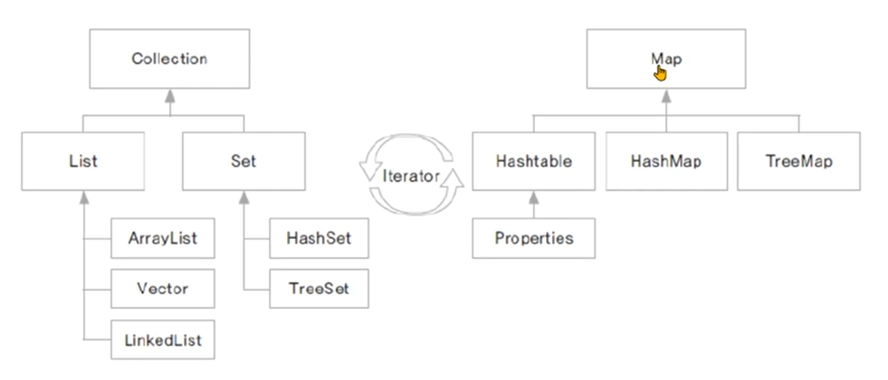

### 01. 여러가지 자료구조
- ### 자료구조
    - 많은 데이터를 메모리 상에서 관리하는 여러 구현방법들
    - 프로그램의 수행속도와 밀접한 관련이 있음
    - 프로그램에 맞는 최적의 자료구조를 활용해야 함

- ### 자료구조 종류
    - **선형 자료구조**
        - 선형으로 자료를 관리
        - **배열 (Array)**
            - 정해진 크기의 메모리를 먼저 할당받아 사용
            - 자료의 물리적 위치와 논리적 위치가 동일
            - jdk 클래스
                - ArrayList, Vector
        - **연결 리스트 (LinkedList)**
            - 자료가 추가될 때마다 메모리를 할당 받음
            - 자료의 물리적 위치와 논리적 위치가 다를 수 있음
                - 자료는 링크로 연결됨
        - **스택 (Stack)**
            - LIFO (Last In First Out)
            - 가장나중에 입력된 자료가 가장 먼저 출력
        - **큐 (Queue)**
            - FIFO (First In First Out)
            - 가장 먼저 입력된 자료가 가장 먼저 출력
    - **트리 자료구조**
        - 부모 노드와 자식 노드간의 연결로 이루어진 자료 구조
        - **힙 (Heap)**
            - Priority queue를 구현
            - heap 정렬에 활용
        - **이진 트리 (binary tree)**
            - 부모노드에 자식노드가 두 개 이하인 트리
        - **이진 검색 트리 (binary search tree)**
            - 자료의 중복 허용 X
            - 왼쪽 자식 노드는 부모 노드보다 작은 값
            - 오른쪽 자식 노드는 부모 노드보다 큰 값
    - **그래프 자료구조**
        - 정점과 간선들의 유한 집합
        - 구현 방법
            - 인접 행렬, 인접 리스트
        - 탐석 방법
            - BFS, DFS
    -  **해싱 자료구조**
        - 자료를 검색하기 위한 자료 구조
        - 키에 대한 자료를 검색하기 위한 사전(dictionary)개념의 자료 구조
            - key는 유일 / value를 쌍으로 저장
        - jdk 클래스
            - HashMap, Properties

### 07. 무엇이든 담을 수 있는 제네릭(Generic) 프로그래밍
- ### 클래스의 자료형을 특정하지 않고, 추후 사용할때 지정 할 수 있음.
    - 컬렉션 프레임워크에서 많이 사용 됨.

- 자료형 매개변수 T (Type Parameter)
    - 이 클래스를 사용한느 시점에 실제 사용할 자료형을 지정
    - 아무 알파벳이든 가능.
    
- ### 다이아몬드 연산자 < >
    - 다이아몬드 연산자 내부의 자료형은 생략 가능

### 08. <T extends 클래스> 사용하기
- ### 상위 클래스의 필요성
    - **T 자료형의 범위를 제한** 
    - 해당 클래스에서 정의한 클래스의 자료형으로만 한정함.

### 09. 제네릭 메서드 활용하기
- ### 제네릭 메서드란?
    - 자료형 매개변수 T(Type Parameter)를 메거드의 매개변수나 반환값으로 가지는 메서드
    - public <자료형 매개변수> 반환형 메서드 이름(자료형 매개변수 ... ){ }
    

### 10. 컬렉션 프레임워크 - 자료구조 구현 클래스들
- ### 컬렉션 프레임워크
    - 프로그램 구현에 필요한 자료구조를 구현해 놓은 JDK 라이브러리
    - java.util 패키지에 구현되어 있음

### 11. Collection 요소를 순회하는 Iterator
- ### 요소의 순회란?
    - 컬렉션 프레임워크에 저장된 요소들을 하나씩 차례로 참조하는 것
    - set 경우에 자주 쓰임
- ### Iterator
    - boolean hasNext() 
        - 이후에 요소가 더 있는지를 확인
    - E next() 
        - 다음에 있는 요소를 반환

### 14. 쌍(pair)으로 자료를 관리하는 Map 인터페이스를 구현한 클래스
- ### HashMap 클래스
