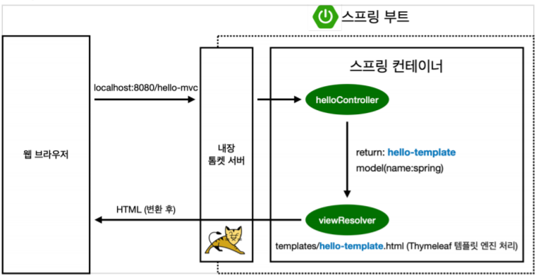

- **Ch2. 스프링 웹 개발 기초**
  - **방법**
    - 정적 컨텐츠
      - 파일을 그대로 웹 브라우저에 전달
    - MVC와 템플릿 엔진
      - JSP / php / … 
      - MVC – model view controller
      - server에서 html을 변형하여 웹 브라우저에 전달
    - API
      - JSON 형태의 데이터를 클라이언트에게 전달
      - Server 사이의 통신에 사용
  - **정적 컨텐츠**
    - Spring boot 가 자동적으로 지원
    - /static/ à 프로그래밍 못함
    - 구동 방식
      - 브라우저 à 톰켓 서버 request
        - 컨트롤러 없을 시 à static 내에서 파일 찾음 à 정적 컨텐츠 반환

- **MVC와 템플릿 엔진**
  - MVC – Model ,View, Controller
    - 역할을 나눔
    - View
      - 화면을 그리는데 집중 – html 파일
    - Model, Controller
      - 비즈니스 로직에 집중
  - 파라미터 전달 방법
    - ?name=전달 à ?파라미터 이름=전달할 값 
  - 구동 방식
    - 브라우저 à 톰켓 서버 request with parameter
    - Controller 가 해당 request 처리 후 viewResolver에게 반환
    - viewResolver가 html 파일 변환 후 웹 브라우저에게 반환

- **API**
  - @ResponseBody – http body에 직접 데이터를 넣어준다.
  - 뷰가 없이 문자 그대로 내려간다. à 소스파일이 html파일이 아닌 문자 그대로 내려줌
  - ` `객체를 만들어 getter setter를 활용해 JSON 형태로 데이터 넘겨줌
    - 심플함
  - getter / setter
    - javabean 조약
    - private 객체를 get / set 메서드를 활용하여 접근
    - property 접근 방식
  - 구동 방식
    - @ResponseBody 사용원리
      - 브라우저 à 톰켓 서버 request with parameter
      - @ResponseBody 있을 시 à http의 body에 객체를 반환 
        à HttpMessageConverter 가 default로 JSON 방식 변환 후 전달 - JsonConverter
        à 문자 일시 StringConverter 수행 

