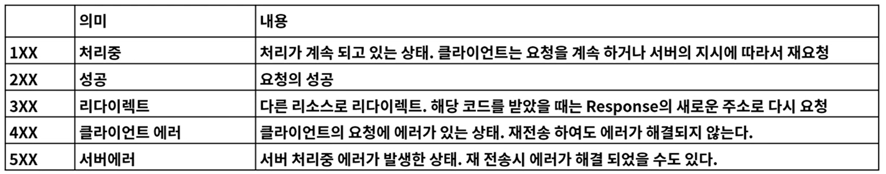

### 1. 웹 이란
- ### WWW, World Wide Web, W3
    - 인터넷에 연결된 컴퓨터를 통해 사람들이 정보를 공유할 수 있는 전 세계적인 정보 공간
    - Web 의 용도
        - Web Site
            - HTML 로 구성된 여러 사이트
        - API Web Service
            - API 를 사용
        - User Interface
            - Chrome, Safari, Smart Watch, IP TV 등
    - Web의 3가지 요소

    
### 2. REST API
- ### REST, Representational State Transfer
    - 자원의 상태 전달, 네트워크 아키텍처
    - 1. Client, Server
        - 클라이언트와 서버가 서로 독립적으로 분리 되어 있어야 한다.
    - 2. Stateless
        - 요청에 대해서 클라이언트의 상태를 서버에 저장하지 않는다.
    - 3. Cache
        - 클라이언트는 서버의 응답을 Cache(임시저장) 할 수 있어야 한다.
    - 4. Layered System (계층화)
        - 서버와 클라이언트 사이에, 방화벽, 게이트웨이, Proxy등 다양한 계층 형태로 구성이 가능해야함
        - 또한, 이를 확장 할 수 있어야 한다.
    - 5. 인터페이스 일관성
        - 인턴페이스의 일관성을 지키고, 아키텍처를 단순화시켜 작은 단위로 분리
        - 클라이언트, 서버가 독립적으로개선 될 수 있어야 한다.
    - 6. Code on Demand (Optional)
        - 특정한 기능을 서버로 부터 클라이언트가 전달받아 코드를 실행 할 수 있어야 한다.
        - 자바 스크립트
        
### 3. URI 설계 패턴
- ### URI (Uniform Resource Identifier)
    - 인터넷에서 특정 자원을 나타내는 주소값
    - 해당 값은 유일 하다.
        - 응답은 달라질 수 있다.
    - ### URL (Uniform Resource Locater)
        - 인터넷 상의 특정 파일의 위치 / 주소
        - URL 은 URI 의 하위 개념 이다.
        
- ### URI 설계 원칙 ( RFC-3986 )
    - 슬래시 구분자 (/)는 계층 관계를 나타낸다.
    - URI 마지막 문자로 (/) 는 포함하지 않는다.
    - 하이픈(-) 은 URI 가독성을 높이게 사용한다.
    - 밑줄(_) 은 사용하지 않는다.
    - 소문자가 적합하다.
    - 파일 확장자를 포함하지 않는다.
    - 의존적인 확장자를 사용하지 않는다.
    - 구현에 의존적인 경로를 사용하지 않는다.
    - 세션 ID를 포함하지 않는다.
    - 프로그래밍 언어의 Method명을 이용하지 않는다.
    - 명사에 복수형을 사용해야 한다.
    - 컨트롤러 이름으로는 동사나 동사구를 사용한다.
    - 경로 부분 중 변하는 부분은 **유일한 값**으로 대체 한다.
    - CRUD 기능을 나타내는 것은 url에 사용하지 않는다.
    - URI Query Parameter 디자인
        - URI 쿼리 부분으로 컬렉션 결과에 대해서 필터링 할 수 있다.
    - API에 있어 서브 도메인은 일관성 있게 사용해야 한다.
        - https://api.fastcampust.co.kr
        - https://api-fastcampust.co.kr
    - 클라이언트 개발자 포탈 서브 도메인은 일관성 있게 만든다.
        - https://dev-fastcampust.co.kr
        - https://developer-fastcampust.co.kr
        
### 4. HTTP Protocol
- ### RFC 2616에서 규정된 Web 에서 데이터를 주고 받는 프로토콜.
    - 다양한 컴퓨터에서 다룰 수 있는 것은 모두전송 할 수 있다.
    - TCP 를 기반으로 함.
    - **특징**
        - HTTP는 메시지를 주고 (Request) 받는 (Response) 형태의 통신 방법 입니다.

- ### HTTP Method 8가지

    - 멱등성
        - 항상 같은 요청에 대해서는 같은 정보가 내려온다.
    - 안전성
        - 데이터가 안전한가
        
- ### HTTP Status Code

    - 자주 사용되는 코드

