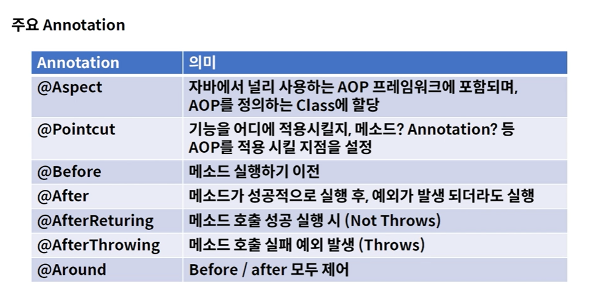
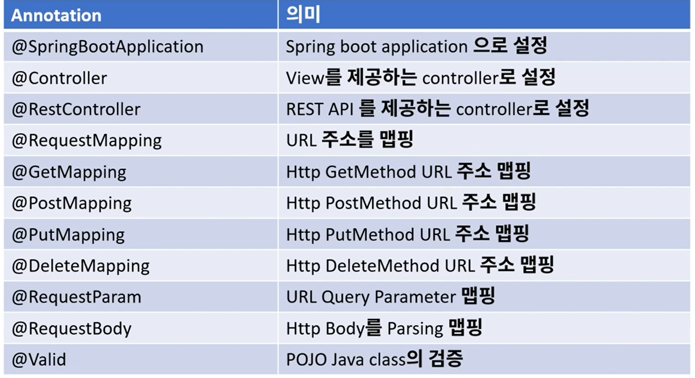
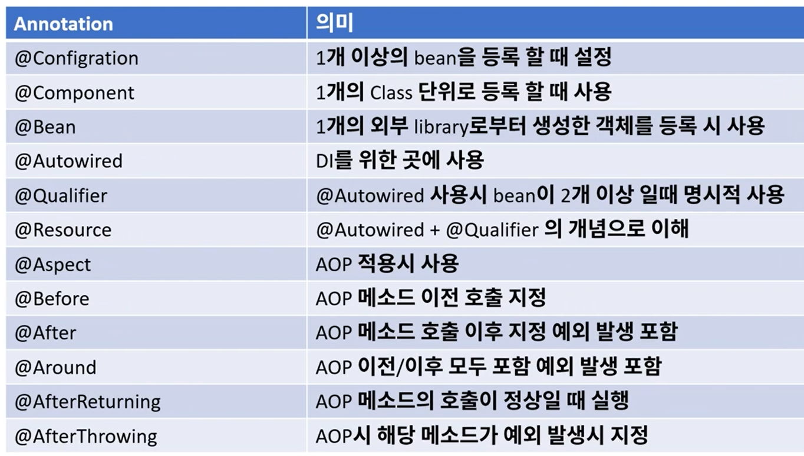

### 01. 스프링의 핵심
- ### Spring
    - 스프링 프레임워크는 20여가지의 모듈들로 구성됨
    - 여러가지 모듈중
        - **스프링 부트, 스프링 클라우드, 스프링 데이터, 스프링 배치, 스프링 시큐리티**에 중점
    - **테스트의 용이성, 느슨한 결합**에 중점을 두고 개발
    - **POJO**
        - IoC / DI - 의존관계 주입
        - AOP - 관점 중심 프로그래밍
        - PSA - 이식 가능한 추상화
        
### 02. IoC (Inversion of Control)
- ### IoC (Inversion of Control)
    - 제어의 역전
    - Java 객체를 Spring Container가 관리한다.
    - 개발자 → 프레임워크로 제어의 객체 관리의 권한이 넘어갔음
    
- ### DI (Dependecy Injection)
    - 의존성 주입
    - 외부로부터 객체를 주입받아 사용할 수 있게 한다.
    - 의존성으로 부터 격리시켜 코드 테스트에 용이함
    - 코드의 변경 및 확장시 영향을 최소화
    - 순환 참조 방지
    
### 03. AOP (Aspect Oriented Programming)
- ### AOP (Aspect Oriented Programming)
    - 관점 지향 프로그래밍 - 횡단 관심
    - MVC 웹 어플리케이션
        - Web Layer - Controller
            - REST API 제공 및 Client 중심의 로직 적용
        - Business Layer - Service
            - 내부 정책에 따른 logic을 개발
        - Data Layer - Repository
            - 데이터 베이스및 외부와의 연동 처리

### 04. Object Mapper
- ### 1) "Java Object" =Serialize=> "JSON"
- ### 2) "JSON" =Deserialize=> "Java Object"
### 05.  Annotations

