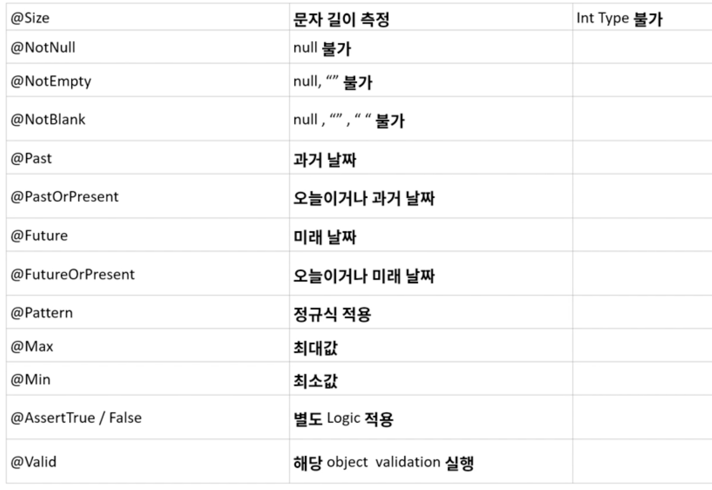

### 01. Validation
- ### Error를 사전에 방지하기 위해서 미리 검증하는 과정
    - Service Logic 과의 분리가 필요 하다.
    - 일관적이어야 함
    - Business Logic 이 들어가면 안된다.
    
- ### Annotation
    - 변수에 Annotation을 붙임
    - validation을 수행하고자 하는 객체 앞에 @Valid 붙임
    - BindingResult타입의 객체에 validation 결과값 담을 수 있음
    
    
- ### Controller 의 RequestParam을 Validation 수행
    - Controller Class 에 @Validated 추가
    - 해당 RequstParam 에 validation Annotation 추가 
    
### 02. Custom Validation
- ### AssertTrue / False 
    - 재사용 못함
    - dto 부분의 새로운 메서드 정의
    - is 로 시작해야 한다.
    - AssertTrue
        - False 반환 시 error 발생

- ### CustomAnnotaion 으로 Validation 수행 가능

### 03. Spring Boot Exception
- ### Exception 처리
    - **@ControllerAdvice**
        - Global 예외 처리
        - 특정 package / controller 예외 처리
    - **@ExceptionHandler**
        - 특정 class에 작성시 Global적용 안됨
            - 특정 api에 동작
        - 특정 예외 처리 : value = Class 이름 지정
        
    
### 04. Spring Boot Validation
- ### 각 ExceptionHandler의 return의 body에 보내고자 하는 error 객체를 넣어줌
    - 일관적으로 해주기 위해서 사용
    - 예외에 대해서 친절하게 서비스 제공
    
    
    
### 05. Filter & Intercepter
- ### Filter
    - 요청(최초) / 응답(최종) 에 위치
    - 요청/응답의 정보를 변경하거나, Spring에 의해서 데이터가 변환되기 전의 순수한 Client의 요청/응답 값을 확인 할 수 있다.
    - **유일하게 ServletRequest, ServletResponse의 객체를 변환 할 수 있다.**
    - 주로 request / response의 Logging 또는 인증 용도로 활용한다.
    
    
    
- ### Interceptor
    - Filter와 매우 유사한 형태로 존재
    - 차이점은 Spring Context 에 등록 된다.
    - AOP와 유사한 기능을 제공 할 수 있다.
    - 주로 **인증 단계** 를 처리하거나, Logging를 하는데 사용한다.
    - 이를 선/후 처리 함으로써, Service business logic 과 분리 시킨다.
    
    
    
### 06. 비동기 처리 하기
- ### 비동기 기본 설정 - 1
    - Application 에 @EnableAsync 추가
    - 비동기 서비스에 @Async 추가
    
- ### CompletableFuture 활용
    - 다른 쓰레드에서 실행 시킨 후 결과를 반환 받음.
    - 한번에 여러 request 후 결과를 한번에 받을 때.
