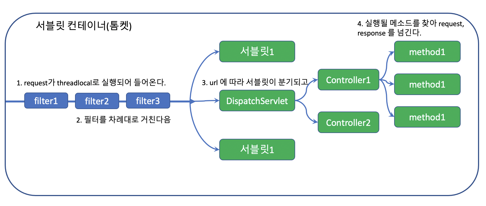
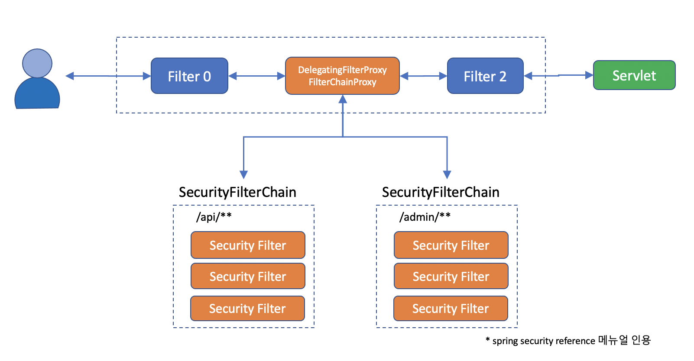

# 스프링 시큐리티의 큰 그림

## 서블릿 컨테이너

- 톰켓과 같은 웹 애플리케이션을 서블릿 컨테이너라고 부르는데, 이런 웹 애플리케이션(J2EE Application)은 기본적으로 필터와 서블릿으로 구성되어 있습니다.
> 서블릿 컨테이너 : 서버가 여러개의 서블릿들을 담고 있다.



- 필터는 체인처럼 엮여있기 때문에 필터 체인이라고도 불리는데, 모든 request 는 이 필터 체인을 반드시 거쳐야만 서블릿 서비스에 도착하게 됩니다.
- **http 요청은 DispatchServlet 에 들어오기 전에 여러개의 filter 들을 거치고 들어온다.**

## 스프링 시큐리티의 큰 그림

- 그래서 스프링 시큐리티는 DelegatingFilterProxy 라는 필터를 만들어 메인 필터체인에 끼워넣고, 그 아래 다시 SecurityFilterChain 그룹을 등록합니다.
- **DelegatingFilterProxy 에서 각각의 http request 에 적합한 SecurityFilterChain 을 검사한다.**
- **선택적으로 FilterChain 을 거친다.**



- 이 필터체인은 반드시 한개 이상이고, url 패턴에 따라 적용되는 필터체인을 다르게 할 수 있습니다. 본래의 메인 필터를 반드시 통과해야만 서블릿에 들어갈 수 있는 단점을 보완하기 위해서 필터체인 Proxy 를 두었다고 할 수 있습니다.

- web resource 의 경우 패턴을 따르더라도 필터를 무시(ignore)하고 통과시켜주기도 합니다.

## 시큐리티 필터들

- **이 필터체인에는 다양한 필터들이 들어갑니다.**


- 각각의 필터는 단일 필터 단일 책임(?) 원칙 처럼, **각기 서로 다른 관심사**를 해결합니다.. 예를 들면 아래와 같습니다.
  - _HeaderWriterFilter_ : Http 해더를 검사한다. 써야 할 건 잘 써있는지, 필요한 해더를 더해줘야 할 건 없는가?
  - _CorsFilter_ : 허가된 사이트나 클라이언트의 요청인가?
  - _CsrfFilter_ : 내가 내보낸 리소스에서 올라온 요청인가? (POST / PUT 과 같이 서버 자원을 변경하는 request 일때, 서버가 내려보냈던 resource 인지 확인)
  - _LogoutFilter_ : 지금 로그아웃하겠다고 하는건가?
  - _UsernamePasswordAuthenticationFilter_ : username / password 로 로그인을 하려고 하는가? 만약 로그인이면 여기서 처리하고 가야 할 페이지로 보내 줄께. (로그인 처리)
  - _ConcurrentSessionFilter_ : 여거저기서 로그인 하는걸 허용할 것인가? (동시에 여러 곳에서 로그인 하는 것 을 허용할 것인가?)
  - _BearerTokenAuthenticationFilter_ : Authorization 해더에 Bearer 토큰이 오면 인증 처리 해줄께.
  - _BasicAuthenticationFilter_ : Authorization 해더에 Basic 토큰을 주면 검사해서 인증처리 해줄께.
  - _RequestCacheAwareFilter_ : 방금 요청한 request 이력이 다음에 필요할 수 있으니 캐시에 담아놓을께.
  - _SecurityContextHolderAwareRequestFilter_ : 보안 관련 Servlet 3 스펙을 지원하기 위한 필터라고 한다.(특별하게 지원하는 기능이 없음)
  - _RememberMeAuthenticationFilter_ : 아직 Authentication 인증이 안된 경우라면 RememberMe 쿠키를 검사해서 인증 처리해줄께
  - _AnonymousAuthenticationFilter_ : 아직도 인증(Authentication)이 안되었으면 너는 Anonymous 사용자야 (Authentication 이 null 인 것을 방지)
  - _SessionManagementFilter_ : 서버에서 지정한 세션정책을 검사할께.
  - _ExceptionTranslationFilter_ : 나 이후에 인증이나 권한 예외가 발생하면 내가 잡아서 처리해 줄께.
  - _FilterSecurityInterceptor_ : 여기까지 살아서 왔다면 인증이 있다는 거니, 니가 들어가려고 하는 request 에 들어갈 자격이 있는지 그리고 리턴한 결과를 너에게 보내줘도 되는건지 마지막으로 내가 점검해 줄께.
    (Error 발생 시, ExceptionTranslationFilter 에서 처리 됨)
  - 그 밖에... OAuth2 나 Saml2, Cas, X509 등에 관한 필터들도 있습니다.
- 필터는 넣거나 뺄 수 있고 순서를 조절할 수 있습니다. (이때 필터의 순서가 매우 critical 할 수 있기 때문에 기본 필터들은 그 순서가 어느정도 정해져 있습니다.)
- 필터를 직접 생성하여 넣어 줄 수 있음

### request 가 어떤 필터들을 거치고 왔는지 확인하는 방법
- debug 모드를 활성화 해줍니다.
```java 
  @EnableWebSecurity(debug = true)
  public class SecurityConfig extends WebSecurityConfigurerAdapter {
  }
```

### request 의 필터 설정 방법
- HttpSecurity 의 필터 정보를 설정해 주면 된다.
- ex) HeadersWriterFilter 필터 제거
```java
    @Override
    protected void configure(HttpSecurity http) throws Exception {
        http.headers().disable()
    }
```

- **특정 request url 에 특정 필터 추가**
```java
    @Override
    protected void configure(HttpSecurity http) throws Exception {
        http.antMatcher("/api/**")
        http.headers().disable()
    }
```

- **2개 이상의 필터 체인을 구상할 때**
필터의 순서가 중요하다. 
```java 
  @Order(1)
  @EnableWebSecurity(debug = true)
  public class SecurityConfig extends WebSecurityConfigurerAdapter {
  }
  
  @Order(2)
  @EnableWebSecurity(debug = true)
  public class SecurityConfig extends WebSecurityConfigurerAdapter {
  }
```

---

## 실습하기

- 필터 설정하고 확인하기
- 필터를 ignore 하기
- 서로 다른 필터 체인을 타도록 하기
