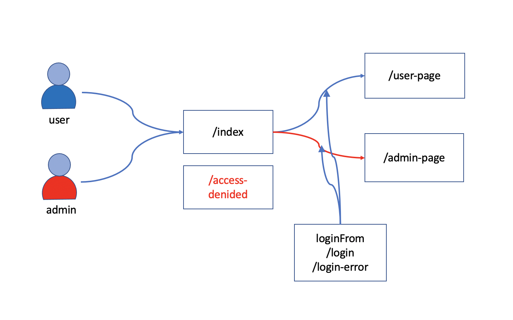

# basic login 실습

- 기획자가 아래와 같은 사이트를 기획했습니다.

  

- 디자이너는 이 사이트를 아래와 같이 디자인 했습니다.
  
- 로그인 페이지를 만들고 기본적인 페이지의 flow 를 실습한다.

## 페이지에 Security 설정하기

- thymeleaf 에 대한 의존성 추가
- bootstrap 을 이용해 기본 페이지 제작
- 기본 로그인 페이지 제작
- csrf 설정
- 로그인 성공시 설정
- 로그인 실패시 설정
- 로그아웃 설정
- UserDetailsSource 설정

## 코드 조각

- resource web ignore 설정

  ```java
    @Override
    public void configure(WebSecurity web) throws Exception {
        web.ignoring()
                .requestMatchers(
                        PathRequest.toStaticResources().atCommonLocations()
                )
                ;
    }
  ```

- 로그인 사용자

  ```java

    auth
      .inMemoryAuthentication()
      .withUser(
              User.withDefaultPasswordEncoder()
              .username("user1")
              .password("1111")
              .roles("USER")
      ).withUser(
      User.withDefaultPasswordEncoder()
              .username("admin")
              .password("2222")
              .roles("ADMIN")
      );

  ```

- thymeleaf 에서 security를 적용하는 태그

  ```html
  <div sec:authorize="isAuthenticated()">
    This content is only shown to authenticated users.
    로그인된 상태에서만 보임
  </div>
  <div sec:authorize="hasRole('ROLE_ADMIN')">
    This content is only shown to administrators.
    Role 이 ADMIN일 경우에만 보임
  </div>
  <div sec:authorize="hasRole('ROLE_USER')">
    This content is only shown to users.
   Role 이 USER인 경우에만 보임
  </div>
  ```

## 참고

- https://www.thymeleaf.org/doc/articles/springsecurity.html
