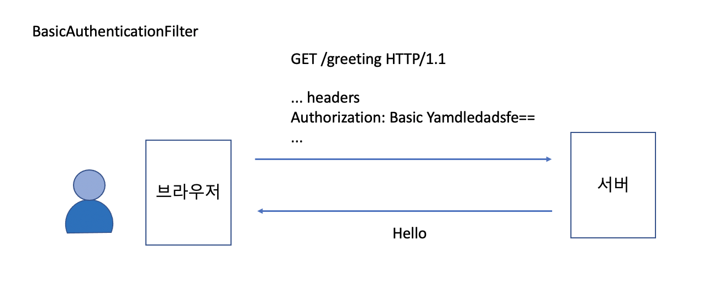
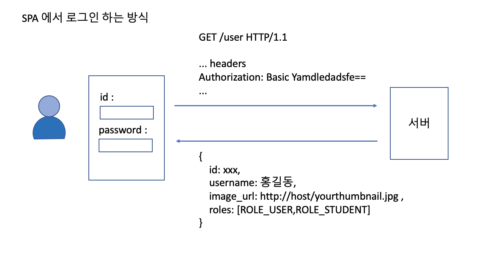

# BasicAuthenticationFilter

- 기본적으로 로그인 페이지를 사용할 수 없는 상황에서 사용합니다.

  - SPA 페이지 (react, angular, vue ...)
  - 브라우저 기반의 모바일 앱(브라우저 개반의 앱, ex: inoic )

- 설정 방법

  ```java
  public class SecurityConfig extends WebSecurityConfigurerAdapter {

    @Override
    protected void configure(HttpSecurity http) throws Exception {
        http
                .httpBasic()
                ;
    }
  }
  ```

- SecurityContext 에 인증된 토큰이 없다면 아래와 같은 포멧의 토큰을 받아서 인증처리를 하고 갑니다.

  

- http 에서는 header 에 username:password 값이 묻어서 가기 때문에 보안에 매우 취약합니다. 그래서, 반드시 https 프로토콜에서 사용할 것을 권장하고 있습니다.
- 최초 로그인시에만 인증을 처리하고, 이후에는 session에 의존합니다. 또 RememberMe 를 설정한 경우, remember-me 쿠키가 브라우저에 저장되기 때문에 세션이 만료된 이후라도 브라우저 기반의 앱에서는 장시간 서비스를 로그인 페이지를 거치지 않고 이용할 수 있습니다.
- 에러가 나면 401 (UnAuthorized) 에러를 내려보냅니다.
- 로그인 페이지 처리는 주로 아래와 같은 방식으로 합니다.
  

## SecurityContextPersistenceFilter

- SecurityContext 를 저장하고 있는 저장소에서 만료되지 않은 인증이 있으면 SecurityContextHolder 에 넣어줍니다. 이전에는 HttpSessionContextIntegrationFilter 이란 필터가 있었는데, 저장소가 반드시 세션일 필요는 없기 때문에 추상화된 객체로 발전된 필터라고 볼 수 있습니다.

- HttpSessionSecurityContextRepository : 서버 세션에 SecurityContext 를 저장하는 기본 저장소.

## Bearer 토큰

- JWT 토큰
- Opaque 토큰
