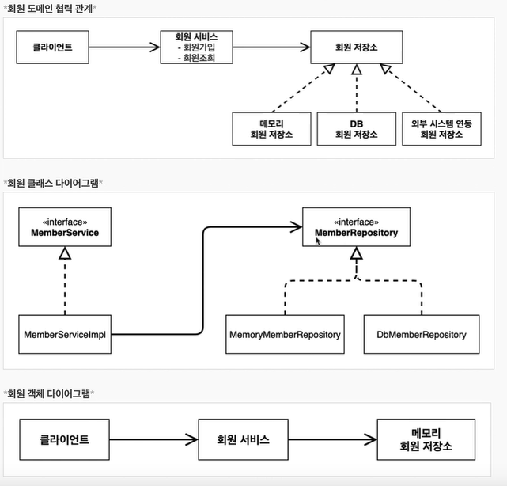
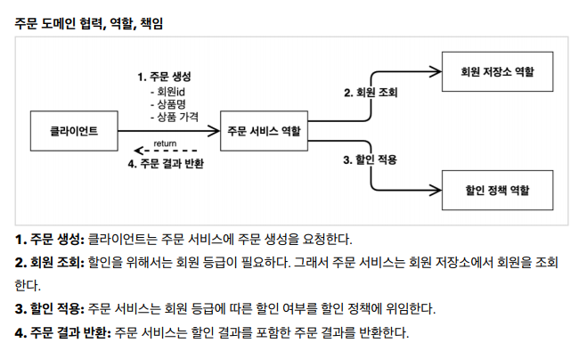
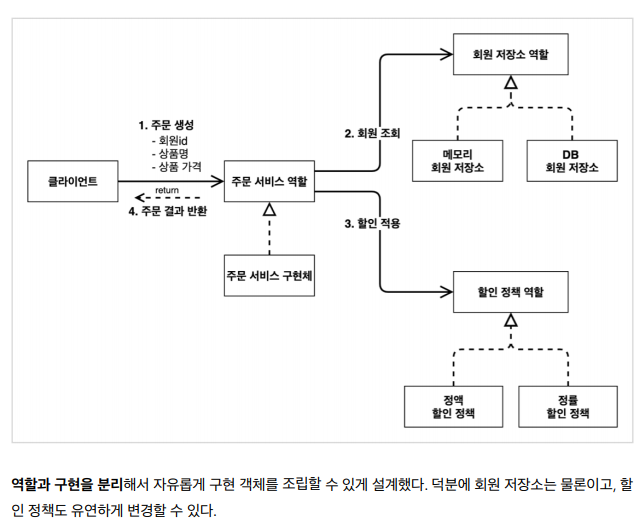
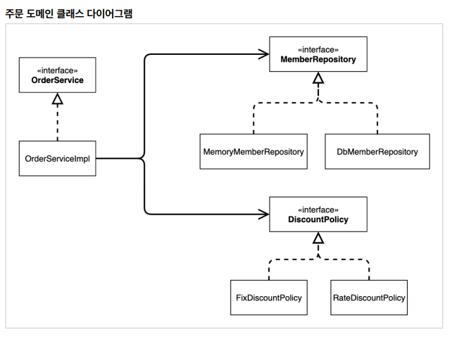
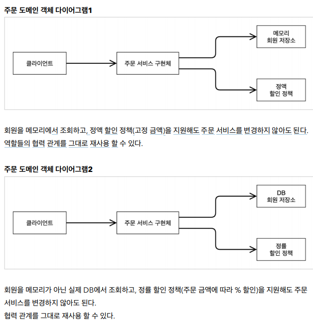

### 01.프로젝트 생성
- **스프링 부트** 
    - https://start.spring.io
    
### 02. 비즈니스 요구사항과 설계
- **정책이 결정 안된 부분을 인터페이스로 개발하여 향후 갈아끼울 수 있게 설계**
- **인터페이스를 만들고 구현체를 언제든지 갈아끼울 수 있도록 설계**

### 03. 회원 도메인 설계
- **회원 도메인 요구사항**
    - 회원가입 및 조회 기능
    - 회원은 일반과 VIP 두 가지 등급
    - 회원 데이터는 자체 DB를 구축할 수 있고, 외부 시스템과 연동할 수 있다.(미확정)

    - 회원 서비스: MemberServiceImpl
    
### 04. 주문과 할인 도메인 설계
- **주문과 할인 정책**
    - 회원은 상품을 주문할 수 있다.
    - 회원 등급에 따라 할인 정책을 적용할 수 있다.
    - 할인 정책은 모든 VIP는 1000원을 할인해주는 고정 금액 할인을 적용해달라. (나중에 변경 될 수 있다.)
    - 할인 정책은 변경 가능성이 높다. 회사의 기본 할인 정책을 아직 정하지 못했고, 오픈 직전까지 고민을 미루고 싶다. 최악의 경우 할인을 적용하지 않을 수 도 있다. (미확정)

- **주문 도메인 전체**

