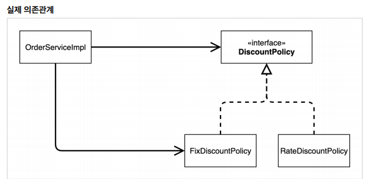
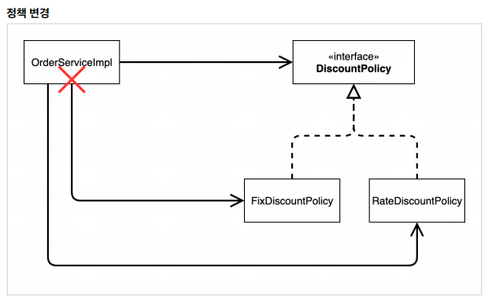
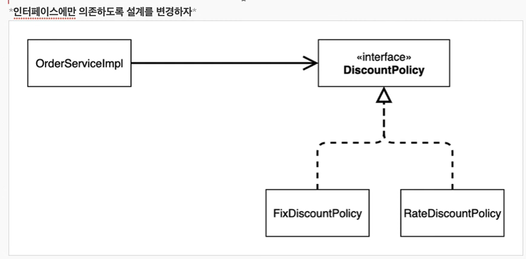
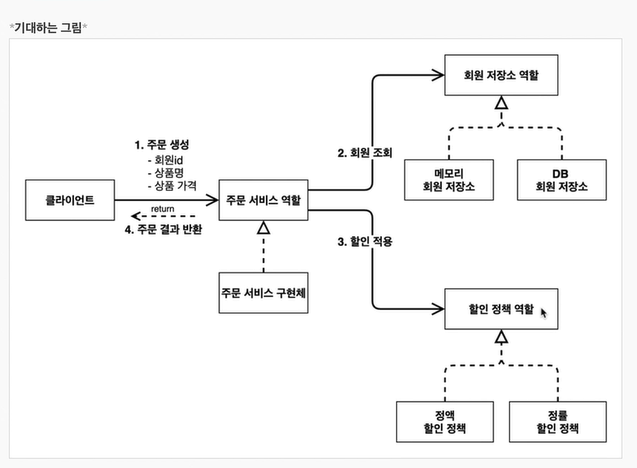
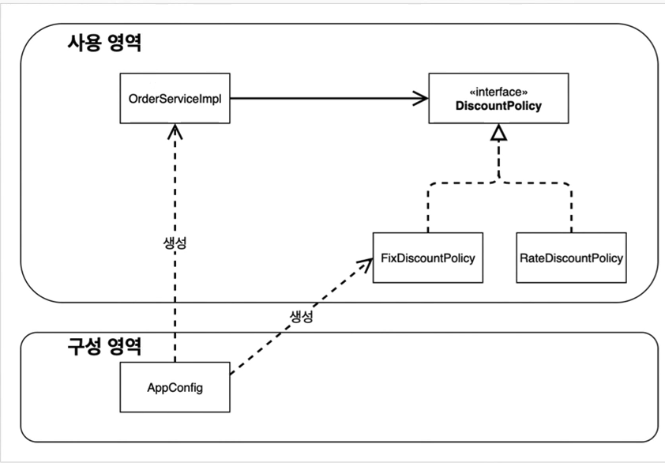

### 01. 새로운 할인 정책 개발
- ### 새로운 정책이 적용 될 시 변화에 쉽게 대응할 수 있도록 
    - **애자일 소프트 웨어 개발** 
        - 계획을 따르기보다 변화에 대응
    - ### 유연한 설계가 가능하도록 객체지향 설계 원칙을 준수해야함

### 02. 새로운 할인 정책 적용과 문제점
- ### 적용
    - 클라이언트 코드 구현체를 수정해야 함
        - **문제점**
            - 역할과 구현을 충실히 분리 함 → OK
            - 다형성 활용 및 인터페이스와 구현 객체 분리 → OK
            - OCP, DIP 객체지향 설계 원칙을 충실히 준수 → NO
                - OCP
                    - 변경하지 않고 확장 가능하게 해야함
                    - **현재 코드는 확장해서 변경 시 → 클라이언트 코드에 영향을 준다.**
                - DIP
                    - 클라이언트는 인터페이스에만 의존해야함
                    - **현재 코드는 클라이언트에서 인터페이스 뿐만 아니라 구현 클래스에도 의존함**
            - 실제 의존 관계
                - **DIP** 위반


            - 정책 변경 시 **OCP** 위반


        - **문제 해결 방법**
            - DIP를 위반하지 않도록 인터페이스에만 의존하도록 의존관계를 변경

                - ``` java
                    private final 인터페이스 인터페이스_객체;
                 ```
                    - DIP는 해결 됬지만,
                    - null point exception 발생
            - **해결 방안**
                - 누군가가 클라이언트에 **해당 인터페이스 구현 객체를 대신 생성**하고 주입해 주어야 함.

### 03. 관심사의 분리
- ### 관심사를 분리하자
    - 클라이언트는 본인의 역할을 수행하는 것에만 집중해야한다.
    - 클라이언트는 다른 역할을 하는 클라이언트와는 분리 되어야 한다. 
    - **각 역할에 맞는 구현 객체 (클라이언트)를 생성하고 연결 하는 책임자가 필요하다.**
    
- ### AppConfig 등장
    - 애플리케이션의 전체 동작 방식을 구성(config)하기 위해, **구현 객체를 생성** 및 **연결**을 책임지는 별도의 설정 클래스
        - 애플리케이션의 실제 동작에 필요한 **구현 객체를 생성** 해준다.
        - 생성한 객체 인스턴스의 참조(레퍼런스)를 **생성자를 통해서 주입(연결)** 해준다.
    - **관심사 분리**
        - **객체 생성 및 연결하는 역할** 과 **실행하는 역할**이 명확히 분리됨.
    - **DI(Depency Injection)**
        - 의존성 주입
        - 클라이언트 입장에서 의존관계를 외부에서 주입해 주는 것
    - App에서 사용 법
        - AppConfig 객체 생성하여 각 객체를 받아옴

### 04. AppConfig 리팩터링
- **현재 AppConfig는 중복 존재 및 역할에 따른 구현이 잘 안보인다.**
    - 기대하는 그림


### 05. 새로운 구조와 할인 정책 적용
- ### FixDiscountPolicy → RateDiscountPolicy
    - **AppConfig**의 등장으로 애플리케이션이 크게 **사용 영역**과, **객체를 생성하고 구성하는 영역**으로 분리됨.

    - 변경 시 
        - AppConfig 만 수정해주면 된다.

### 06. 좋은 객체 지향 설계의 5가지 원칙의 적용
여기서 3가지 SRP,DIP,OCP 적용
- ### SRP 단일 책임 원칙
    - **한 클래스는 하나의 책임만 가져야 한다.**
    - 구현 객체를 생성하고 연결하는 책임은 **AppConfig**가 담당
    - **클라이언트 객체**는 실행하는 책임만 담당
- ### DIP 의존관계 역전 원칙
    - **추상화에 의존해야 한다. → 구체화에 의존하면 안된다.**
    - **의존성 주입은 이 원칙을 따르는 방법**
    - 클라이언트 코드는 인터페이스만으로는 아무것도 실행하지 못한다.
        - NullPointException 발생 가능
    - AppConfig가 구현 객체 인스턴스를 클라이언트 대신 생성 후 
        - 클라이언트에게 의존성 주입
- ### OCP
    - **소프트웨어 요소는 확장에는 열려있으나, 변경에는 닫혀 있어야 한다.**
    - 애플리케이션을 사용 영역과 구성 영역으로 나눔
    - **소프트웨어 요소를 새롭게 확장해도 사용 영역의 변경은 닫혀 있다.**
    - 다형성 사용 후 클라이언트가 DIP를 지킴

### 07. IOC, DI, 컨테이너
- ### 제어의 역전 IOC(Inversion of Control)
    - **프로그램에 대한 제어 흐름에 대한 권한**을 모두 AppConfig가 가지고 있다.
    - 프로그램의 제어 흐름을 **외부에서 관리하는것**
    
    
- **프레임워크 VS 라이브러리**
    - 프레임워크
        - 내가 작성한 코드를 제어 및 대신 실행
    - 라이브러리
        - 내가 작성한 코드가 직접 제어의 흐름을 담당

- ### 의존관계 주입 DI(Dependency Injection)
    - **정적인 클래스 의존 관계와, 실행 시점에 결정되는 동적인 객체(인스턴스) 의존 관계** 둘을 분리해서 생각해야 한다.
    - **정적인 클래스 의존 관계**
        - 클래스가 사용하는 import 코드만 보고 의존관계를 쉽게 판단
        - 애플리케이션을 실행하지 않아도 분석 해야 한다.
    - **의존관계 주입**
        - 애플리케이션 실행 시점(런타임)에 외부에서 실제 구현 객체를 생성
        - 클라이언트에 전달해서 클라이언트와 서버의 실제 의존관계가 연결 되는 것
        - 즉, 객체 인스턴스를 외부에서 생성 하고, 해당 참조값을 클라이언트에게 전달해 연결하는 것.
   - 장점
       - 클라이언트 코드 변경 없이, 클라이언트가 호출하는 대상의 타입 인스턴스 변경 가능
       - 정적인 클래스 의존관계 변경 없이, 동적인 객체 인스턴스 의존관계를 쉽게 변경 가능
           - 클래스 다이어그램 변경 필요 없음
        
- ### 컨테이너
    - **IOC컨테이너, DI 컨테이너**
        - AppConfig처럼 객체를 생성, 관리 및 의존관계 연결해주는 것
        - **스프링이 해당 역할을 한다.**
        - 또는, 어샘블러(조립), 오브젝트 팩토리(오브젝트를 만든다.) 등으로 불리기도 한다.

### 08. 스프링으로 전환하기
- ### AppConfig
    - @Configuration
        - 해당 클래스가 설정 정보라는 것을 뜻한다.
    - @Bean
        - 각 메소드를 스프링 컨테이너에 등록한다.
        
- ### App
    - ``` java
        ApplicationContext applicationContext = new AnnotationConfigApplicationContext(AppConfig.class); 
        // 스프링 컨테이너에 객체 생성 및 주입 하여 관리
        MemberService memberService = applicationContext.getBean("memberService", MemberService.class); 
        // 기본적으로 메서드 이름으로 등록되기 때문에 해당 이름을 전달, 반환 타입 결정
    ```
- ### 스프링 컨테이너
    - **ApplicationContext** 를 **스프링 컨테이너**라 한다.
    - @Configuration 이 붙은 AppConfig 를 설정(구성) 정보로 사용한다. 
        - @Bean 이라 적힌 메서드를 모두 호출해서 반환된 객체를 스프링 컨테이너에 등록한다.
            - 등록된 객체를 **스프링 빈** 이라 한다.
            - @Bean이 붙은 메서드 명을 **스프링 빈의 이름**으로 사용
        - ``` java
            applicationContext.getBean(스프링 빈의 이름, 반환 객체 타입) 
        ``` 
            - 메서드를 통해 스프링 빈을 찾아서 사용
