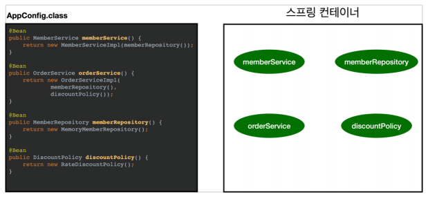
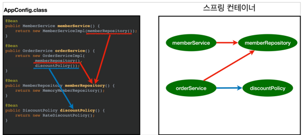
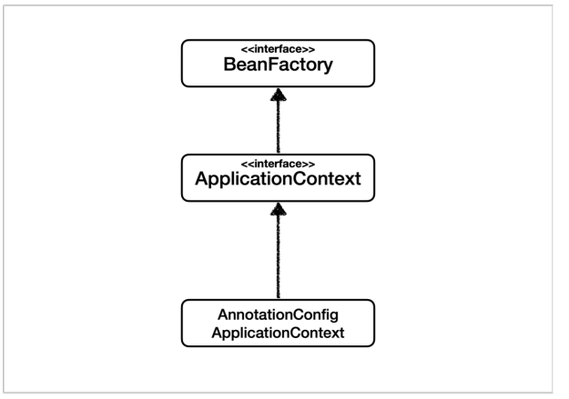
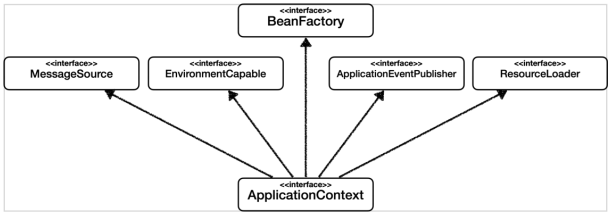
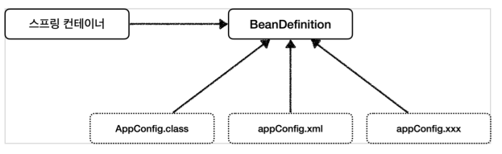

### 01. 스프링 컨테이너 생성
- ### 스프링 컨테이너 생성되는 과정
    - ``` java
        ApplicationContext applicationContext = new AnnotationConfigApplicationContext(AppConfig.class);
        ```
    - **ApplicationContext**
        - 스프링 컨테이너 이다.
            - 생성 방법
                - XML 기반
                - Annotation 기반의 자바 설정 클래스로 생성
            - 'BeanFactory' 와 'ApplicationContext' 로 구분해서 이야기 한다.
        - 인터페이스 이다.
    1. 스프링 컨테이너 생성
        - 
        - ``` java 
            new AnnotationConfigApplicationContext(AppConfig.class)
            ```
        - AppConfig.class
            - 스프링 컨테이너 생성시 구성 정보를 지정
    2. 스프링 빈 등록
        - 
        - @Bean annotation이 붙은 모든 메서드를 확인 후 스프링 빈에 등록한다.
    3. 스프링 빈 의존관계 설정 - 준비
        - 
    4. 스프링 빈 의존관계 설정 - 완료
        - 의존관계를 주입(DI) 한다.
        - 
    - **참고**
        - 스프링은 단계가 나누어져 있다.
            - 스프링 빈 생성
            - 의존관계 주입
        - 하지만, 자바 코드는 한번에 처리 된다. → 의존관계 자동 주입에서 다시 설명

### 02. 컨테이너에 등록된 모든 빈 조회
- ### 모든 빈 출력하기
    - ``` java
        //Spring Container 생성 및 빈 등록 및 의존관계 주입 완료
        AnnotationConfigApplicationContext ac = new AnnotationConfigApplicationContext(AppConfig.class);
        ```
    - ``` ac.getBeanDefinitionNames() ``` : 스프링에 등록된 모든 빈 이름을 조회
    - ``` ac.getBean() ``` : 빈 이름으로 빈 객체(인스턴스)를 조회

- ### 애플리케이션 빈 출력하기
    - 사용자가 정의한 빈 출력
    - getRole() 로 역할 받아오기
        - ROLE_APPLICATION = 일반적으로 사용자가 정의한 빈
        - ROLE_INFRASTRUCTURE = 스프링이 내부에서 사용하는 빈

### 03. 스프링 빈 조회 - 기본
- 방법
    - ``` ac.getBean(빈이름, 타입) ```
    - ``` ac.getBean(타입) ```
    - 조회 대상 스프링 빈이 없을 시 예외 발생

### 04. 스프링 빈 조회 - 동일한 타입이 둘 이상
- ### ac.getBean(타입)으로 조회 시 동일한 타입이 둘 이상 일때
    - 예외 발생
        - NoUniqueBeanDefinitionException
    - 빈 이름을 지정하여 조회
- ### ac.getBeansOfType(타입)
    - 해당 타입의 모든 빈을 조회

### 05. 스프링 빈 조회 - 상속 관계
- ### 부모 타입으로 조회 시, 자식 타입도 함께 조회된다.
    - 즉, Object 타입으로 조회 시 모든 스프링 빈을 조회 가능.


### 06. BeanFactory와 ApplicationContext

- ### BeanFactory
    - 스프링 컨테이너의 최상위 인터페이스이다.
    - 스프링 빈을 관리하고 조회하는 역할을 담당.
    - ``` getBean()``` 을 제공
- ### ApplicationContext
    - BeanFactory의 기능을 모두 상속받아서 제공한다.
    - BeanFactory 와의 차이점
        - 빈을 관리하고 조회하는 기능 외의 수 많은 부가기능 제공
        - 
            - 메시지소스를 활용한 국제화 기능
                - 여러 언어 소스 기능을 제공
            - 환경 변수
                - 로컬, 개발, 운영등을 구분해서 처리한다.
            - 애플리케이션 이벤트
                - 이벤트를 발행하고, 구독하는 모델을 편리하게 지원
            - 편리한 리소스 조회
                - 파일, 클래스 패스, 외부 등에서 리소스를 편리하게 조회
                
- **BeanFactory 나 ApplicationContext 를 둘 다 스프링 컨테이너 라 한다.**

### 07. 다양한 설정 형식 지원 - 자바 코드, XML
- ### 스프링 컨테이너는 다양한 형식의 설정 정보를 받아드릴 수 있게 유연하게 설계 되어 있다.
    - **자바 코드, XML, Groovy 등등** 
    - 최근에는 자바 코드 설정 코드를 많이 사용한다.

### 08. 스프링 빈 설정 메타 정보 - BeanDefinition
- ### 스프링이 다양한 설정 형식을 지원할 수 있는 이유
    - **BeanDefinition이라는 추상화**
    - **역할과 구현을 개념적으로 나눈 것**
    - 스프링 컨테이너는 오직 BeanDefinition만 알면 된다.
        - 자바 코드인지 XML 인지 모름
    - ### BeanDefinition 을 설정 메타 정보라 한다.

