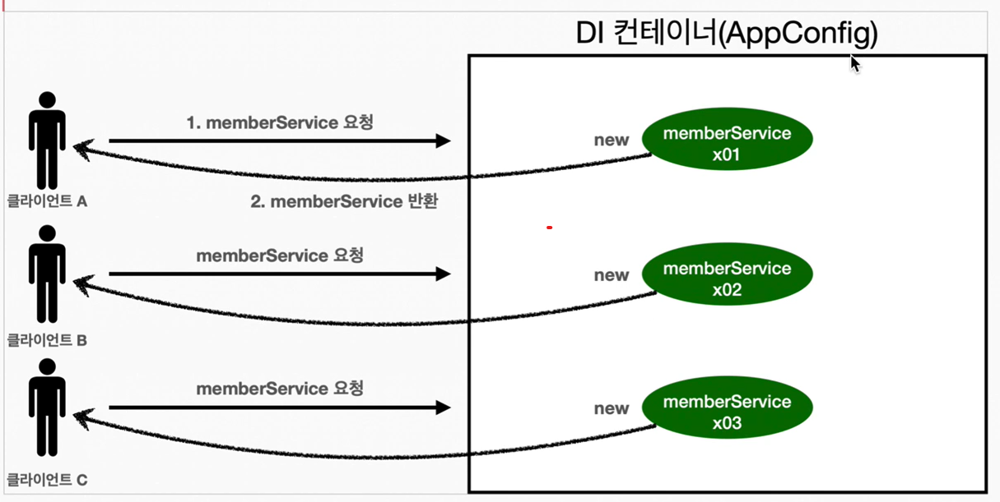
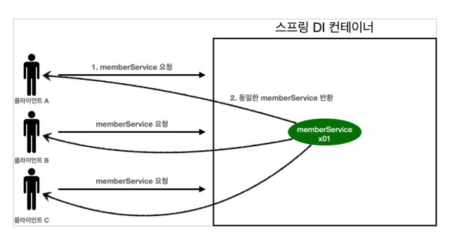
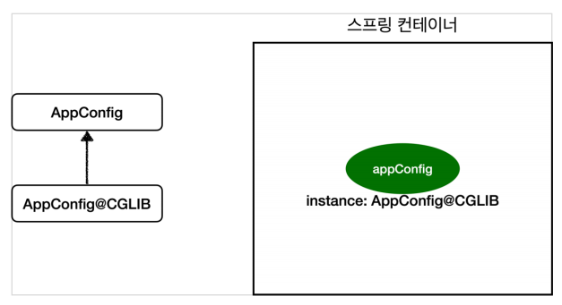
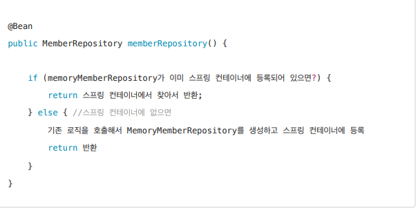

### 01. 웹 애플리케이션과 싱글톤
- ### 웹 애플리케이션은 보통 여러 고객이 동시에 요청한다.

    - ### 고객이 요청하는 객체를 딱 1개만 생성하고 공유하도록 한다. → 싱글톤 패턴

### 02. 싱글톤 패턴
- ### 클래스의 인스턴스가 딱 1개만 생성되는 것을 보장하는 디자인 패턴이다.
    - private 생성자를 사용해서 외부에서 임의로 new 키워드를 사용하지 못하도록 막아야 한다.
    - 1. static 영역에 객체 instance를 미리 하나 생성해서 올려둔다.
    - 2. 해당 객체 인스턴스가 필요 시
        - 오직 getInstance() 메서드를 통해서만 조회 가능
        - 항상 같은 인스턴스를 반환
    - 3. 해당 객체의 생성자를 private로 선언
        - 외부에서 new 키워드로 객체 인스턴스가 생성되는것을 막는다.
    - ### 해당 방법은 스프링 컨테이너 사용시 자동으로 처리해준다.
    - **싱글톤 패턴의 문제점**
        - 코드 자체가 많이 들어간다.
        - DIP 위반
            - 클라이언트가 구체 클래스에 의존한다.
        - OCP 위반 가능성 높음
            - 클라이언트가 구체 클래스에 의존
        - 테스트 하기 어려움
        - 내부 속성을 변경하거나 초기화 하기 여러움
        - private 생성자로 자식 클래스를 만들기 어려움
        - 유연성이 떨어짐
            - DI 가 어려움.
        - 안티패턴으로 불리기도 한다.
    
### 03. 싱글톤 컨테이너
- ### = 스프링 컨테이너
    - 싱글톤 패턴의 문제 해결
    - 객체 인스턴스를 싱글톤(1개만 생성) 으로 관리
    - 싱글톤 패턴을 위한 지저분한 코드가 들어가지 않아도 된다.
    - DIP, OCP, 테스트, private 생성자로 부터 자유롭게 싱글톤 사용 가능
    - **싱글톤 컨테이너 적용 후**

### 04. 싱글톤 방식의 주의점
- ### 싱글톤 객체는 상태를 유지(stateful)하게 설계하면 안된다.
    - 객체 인스턴스를 하나만 생성해서 공유하는 싱글톤 방식은 여러 클라이언트가 하나의 같은 객체 인스턴스를 공유하기 때문에
    
- ### 무상태(stateless)로 설계해야 한다.
    - **공유되지 않는 지역변수 / 파라미터 등을 사용한다.**
    - 특정 클라이언트에 의존적인 필드가 있으면 안된다.
    - 특정 클라이언트가 값을 변경할 수 있는 필드가 있으면 안된다.
    - 가급적 읽기만 가능해야 한다.
    - 스프링 빈의 필드에 공유 값을 설정하면 안된다.
    
### 05. @Configuration과 싱글톤
- ### @Configuration
    - 싱글톤 컨테이너를 위해 존재하는 것.
    
### 06. @Configuration과 바이트코드 조작의 마법
- ### 스프링 컨테이너 = 싱글톤 레지스트리
    - 스프링 빈이 싱글톤이 되도록 보장 필요.
    - 스프링은 클래스의 바이트코드를 조작하는 라이브러리를 사용
- ### AppConfig 빈 등록 과정
    - 스프링이 CGLIB라는 바이트코드 조작 라이브러리를 사용해서 AppConfig 클래스를 상속받은 임의의 다른 클래스를 만들고
        - 그 다른 클래스를 스프링 빈으로 등록한 것이다!

    - **AppConfig@CGLIB 예상 코드**

    - @Bean이 붙은 메서드마다
        - 이미 스프링 빈이 존재한다면 존재하는 빈을 반환
        - 없으면 생성해서 스프링 빈으로 등록하고 반환
- ### @Configuration 사용 안할 시
    - CGLIB 기술을 사용하지 않아, 싱글톤이 보장되지 않는다.
    - **스프링 설정정보는 고민하지 않고 @Configuration을 사용하자**
