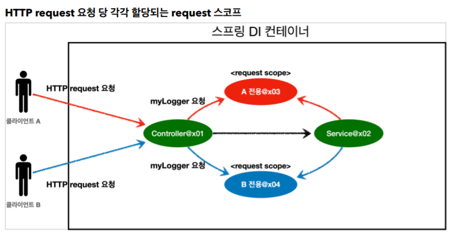
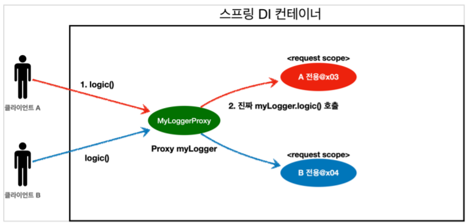

### 01. 빈 스코프란?
- ### 빈이 존재할 수 있는 범위 - 시점
    - 싱글톤
        - 스프링 컨테이너의 시작과 종료까지 유지되는 가장 넓은 범위의 스코프
    - 프로토 타입
        - 빈의 생성과 의존관계 주입까지만 관여
        - 매우 짧은 범위의 스코프
    - **웹 관련 스코프**
        - request : 웹 요청이 들어오고 나갈때 까지 유지되는 스코프
        - session : 웹 세션이 생성되고 종료될 때 까지 유지되는 스코프
        - application : 웹의 서블릿 컨텍스트와 같은 범위로 유지되는 스코프
    - 빈 스코프 지정 방법
        - ``` java
            @Scope("스코프 타입")

### 02. 프로토 타입 스코프
- 프로토 타입 스코프를 스프링 컨테이너에 조회할 시 
    - 스프링 컨테이너는 항상 새로운 인스턴스를 생성해서 반환한다.
    - **스프링 컨테이너는 프로토 타입 빈 생성, 의존관계 주입, 초기화 까지만 처리한다.**
    - 클라이언트에 빈을 반환 후, 스프링 컨테이너는 생성괸 빈을 관리하지 않는다.
        - **@PreDestroy 같은 종료 메서드가 호출되지 않는다.**
        - 반환 후 클라이언트가 관리
    - **빈은 스프링 컨테이너에서 빈을 조회할 대 생성되고, 초기화 메서드도 실행된다.**
    - 싱글톤은 항상 같은 인스턴스의 스프링 빈을 반환.
    
- ### 정리
    - 스프링 컨테이너에 요청할 때 마다 새로 생성된다.
    - 스프링 컨테이너는 프로토타입 빈의 생성과 의존관계 주입 그리고 초기화까지만 관여한다.
    - 종료 메서드가 호출되지 않는다.
    - 그래서 프로토타입 빈은 프로토타입 빈을 조회한 클라이언트가 관리해야 한다. 
        - 종료 메서드에 대한 호출도 클라이언트가 직접 해야한다.
        
### 03. 프로토 타입 스코프 - 싱글톤 빈과 함께 사용시 문제점
- ### 싱글톤 빈과 함께 사용시 항상 새로운 객체 인스턴스를 생성해 반환하지 않을 수 있다.
    - 프로토 타입 빈은 최초 초기화 시 주입이 끝난 빈이다.
        - 주입 시점에 스프링 컨테이너에 요청해서 프로토 타입 빈이 새로 생성된 것
        - 클라이언트가 사용할 때 마다 새로 생성되는 것이 아니다!
    - 스프링은 일반적으로 싱글톤 빈을 사용하므로, 싱글톤 빈이 프로토타입 빈을 사용하게 된다.
        - **실제 원하는 것은, 사용할 때 마다 프로토 타입 빈을 새로 생성하여 사용하는 것이다.**

### 04. 프로토 타입 스코프 - 싱글톤 빈과 함께 사용시 Provider로 문제 해결
- 싱글톤 빈과 프로토타입 빈을 함께 사용할 때, 어떻게 하면 사용할 때 마다 항상 새로운 프로토타입 빈을 생성할 수 있을까?
- ### 스프링 컨테이너에 요청 - 의존관계 조회 (Dependecy Lookup)
    - 의존관계를 외부에서 주입받는 것이 아니라, 필요시 직접 필요한 의존관계를 찾는 것
    - 싱글톤 빈이 @Autowired로 ApplicationContext를 받음 
    - 호출 시 빈 생성
    
- ### ObjectFactory, ObjectProvider
    - 지정한 빈을 컨테이너에서 대신 찾아주는 DL 서비스를 제공하는 것이 바로 ObjectProvider 이다.
    - ObjectProvider 의 getObject() 를 호출하면 내부에서는 스프링 컨테이너를 통해 해당 빈을 찾아서 반환한다. (DL)
    - 특징
        - ObjectFactory: 기능이 단순, 별도의 라이브러리 필요 없음, 스프링에 의존
        - ObjectProvider: ObjectFactory 상속, 옵션, 스트림 처리등 편의 기능이 많고, 별도의 라이브러리 필요 없음, 스프링에 의존
        
- ### JSR-330 Provider
    - 패키지 : javax.inject.Provider
    - 사용 방법
        - gradle에 라이브러리 추가 - javax.inject:javax.inject:1
    - provider 의 get() 을 호출하면 내부에서는 스프링 컨테이너를 통해 해당 빈을 찾아서 반환한다. (DL)
    - 특징
        - get() 메서드 하나로 기능이 매우 단순하다.
        - (build.gradle) 별도의 라이브러리가 필요하다.
        - 자바 표준이므로 스프링이 아닌 다른 컨테이너에서도 사용할 수 있다.
    
### 05. 웹 스코프
- ### 특징
    - 웹 스코프는 웹 환경에서만 동작한다.
    - 웹 스코프는 프로토타입과 다르게 스프링이 해당 스코프의 종료시점까지 관리한다. 
        - 따라서 종료 메서드가 호출된다.
- ### 종류
    - **request** 
        - HTTP 요청 하나가 들어오고 나갈 때 까지 유지되는 스코프, 각각의 HTTP 요청마다 별도의 빈 인스턴스가 생성되고, 관리된다.
    - **session**
        - HTTP Session과 동일한 생명주기를 가지는 스코프
    - **application**
        - 서블릿 컨텍스트( ServletContext )와 동일한 생명주기를 가지는 스코프
    - **websocket**
        - 웹 소켓과 동일한 생명주기를 가지는 스코프



### 06. request 스코프 예제 만들기
- ### 웹 환경 추가
    - 웹 스코프는 웹 환경에서만 동작하므로 web 환경이 동작하도록 라이브러리 추가
    - 스프링 부트는 내장 톰켓 서버를 활용해서 웹 서버와 스프링을 함께 실행시킨다.
    - 웹과 관련된 추가 설정과 환경들이 필요하므로 AnnotationConfigServletWebServerApplicationContext 를 기반으로 애플리케이션을 구동
    
- ### request 스코프 예제 개발
    - 기대하는 공통 포멧
        - [UUID][requestURL]{message}
        - UUID 를 사용해서 HTTP 요청을 구분
        - requestURL : 어떤 URL을 요청해서 남은 로그인지 확인
    - @Scope(value = "request") 
        - HTTP 요청 당 하나씩 생성된다.
        - **생존 범위가 HTTP 요청이 들어오고 나갈 때 까지**
            - Provider를 이용하여 HTTP 요청이 들어올때 마다 빈을 스프링 컨테이너에 요청하여 의존성 주입을 한다.
            
- **참고**
    -  requestURL을 MyLogger에 저장하는 부분은 **공통 처리가 가능한 스프링 인터셉터나 서블릿 필터 같은 곳을 활용하는 것이 좋다.**
    
### 07. 스코프와 Provider
- ### ObjectProvider 활용
    - ObjectProvider 덕분에 ObjectProvider.getObject() 를 호출하는 시점까지 request scope 빈의 생성을 지연할 수 있다.
    - ObjectProvider.getObject() 를 호출하시는 시점에는 HTTP 요청이 진행중이므로 request scope 빈의 생성이 정상 처리된다.
    
### 08. 스코프와 프록시
- ``` java
    @Component
    @Scope(value = "request", proxyMode = ScopedProxyMode.TARGET_CLASS)
    public class MyLogger {
    } 
    ``` 
    
    - 적용 대상이 클래스면 TARGET_CLASS 를 선택
    - 적용 대상이 인터페이스면 INTERFACES 를 선택
- **CGLIB라는 라이브러리로 내 클래스를 상속 받은 가짜 프록시 객체를 만들어서 주입한다**
- **가짜 프록시 객체는 요청이 오면 그때 내부에서 진짜 빈을 요청하는 위임 로직이 들어있다**
    - 가짜 프록시 객체는 원본 클래스를 상속 받아서 만들어졌기 때문에 이 객체를 사용하는 클라이언트 입장에서는 사실 원본인지 아닌지도 모르게, 동일하게 사용할 수 있다(다형성)

