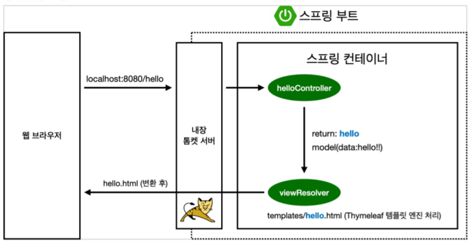

## Ch1. 프로젝트 환경 설정
  - ### 프로젝트 생성
    - Start.spring.io 에서 생성
    - Project
      - 빌드 및 라이프 사이클 관리 하는 툴
        - Maven / Gradle → Gradle 많이 씀
      - Project metadata
        - Group – 그룹 이름 or 도메인 이름 
        - Artifact – 결과 물 – 프로젝트 이름
    - Dependencies
      - 어떤 라이브러리를 사용 할 것 인지
      - 웹 – Spring web
      - Html 템플릿 – Thymeleaf
  - ### Ide – IntelliJ 사용
    - Main
      - Java → 실제 패키지 및 소스 파일
    - test
      - 테스트 관련 소스 코드
    - build.gradle
      - start.spring.io 로부터 자동 작성 됨.
      - Repositories – mavenCentral()
        - 라이브러리를 다운로드 받는 곳
        - 필요 시 특정 사이트의 url 작성 가능
      - Dependencies
        - Springboot 에서 선택한 라이브러리 작성 됨
    - .gitignore
      - Git에 필요한 소스코드만 올라가도록 도와줌
  - ### 실행 시
    - Tomcat started on port(s): 8080 (http) → 정상 작동
    - 웹에서 localhost:8080 입력 후 이동시 error page 뜨면 성공
  - ### 라이브러리 살펴보기
    - External Libraries에서 확인 가능
      - 의존성(dependencies) 관리
      - Gradle → dependencies에서 확인가능
      - 관련 라이브러리 전체 다 끌고 옴
    - Spring-boot-starter-web
      - Spring-boot-starter-tomcat : 톰캣(웹 서버)
      - Spring-webmvc : 스프링 웹 MVC
    - 템플릿
      - Spring-boot-starter-thymeleaf : 타임리프 템플릿 엔진(View)
    - Log
      - 현업에서는 System.out.println(); 사용 안함
      - Log를 사용하여 남김
        - Spring-boot-starter-logging
          - Logback 또는 slf4j 사용
    - Test
      - junit 라이브러리 많이 사용 – ver.5 많이 사용
      - spring-test : 스프링 통합 테스트 지원
  - ### View 환경 설정
    - 실제 띄워지는 화면 설정 – front
    - 초기 페이지 – welcome page 기능
      - resource – static – index.html 파일 생성
        - 정적 페이지
      - 템플릿 엔진을 통하여 정적 페이지를 변경 가능
        - Thymeleaf 이용
          - 서버 없이 열어도 파일을 확인 할 수 있음

- ### 컨트롤러
  - 컨트롤러 생성 후 annotation 작성 필수 → controller
  - Getmapping(“메서드 이름”)
    - Localhost:8080/메서드 이름
  - 컨트롤러에서 리턴 값으로 문자를 반환하면 ViewResolver가 화면을 찾아서 처리
    - 스프링 부트 템플릿 엔진 기본 viewName 매핑
    - ‘Resources:templates/’ + {ViewName} + ‘html’
- ### 빌드하고 실행하기
  - 빌드
    - 윈도우 – gradlew build
    - 이전 build 기록 지우고 다시 빌드
      - gradlew clean build
    - 빌드 후 서버 실행
      - Build 폴더 → jar 파일 실행
        - Java -jar 파일이름.jar

