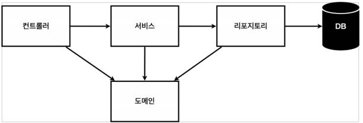
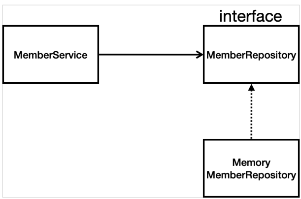

## Ch3. 회원 관리 예제
- ### 비즈니스 요구사항 정리
    - 데이터 : 회원 ID, 이름
    - 기능 : 회원 등록, 조회
    - 아직 데이터 저장소가 선정되지 않음 → 가상의 시나리오
    - ### 일반적인 웹 애플리케이션 계층 구조

 

        - 컨트롤러 : 웹 MVC의 컨트롤러 역할 or API 생성
        - 서비스 : 핵심 비즈니스 로직 구현
            - ex) ID 중복 검사
        - 리포지토리 : 데이터베이스게 접근, 도메인 객체를 DB에 저장하고 관리
        - 도메인 : 비즈니스 도메인 객체
            - ex) 회원, 주문, 쿠폰 등등 주로 데이터베이스에 저장하고 관리됨
    - 클래스 의존 관계

        - 아직 데이터 저장소가 선정되지 않아서, 우선 인터페이스로 구현 클래스를 변경할 수 있도록 설계
        - 개발을 진행하기 위해서 초기 개발 단계에서는 구현체로 가벼운 메모리 기반의 데이터 저장소 사용

- ### 회원 도메인과 리포지토리 만들기
    - 도메인
        - Long id, String name 생성
        - getter / setter 사용
    - 리포지토리
        - interface
            - 해당 기능 선언
            - member save / findById / findByNames / findAll
        - MemoryMemberRepository
            - interface 기능 구현
            - java 파일 참고
            
- ### 회원 리포지토리 테스트 케이스 작성
    - 개발한 기능을 검증 
        - → JUnit 이라는 프레임 워크로 테스트 코드 작성 후 실행 하여 편리하게 테스트 수행
    - @Test annotation 사용  
    - 장점
        - test 에 작성된 전체 클래스를 한번에 테스트 할 수 있다.
        - 순서는 시스템 임의 지정
            - 각 메소드가 끝날 떄마다 repository clear
            - @AfterEach 활용 - Call back 메소드
    - test 주도 개발 (TDD - Test Driven Development)
        - test 먼저 작성 후 구현 클래스 개발
    
- ### 회원 서비스 개발
    - 서비스는 비즈니스에 의존적으로 설계
        - 용어 선택시 비즈니스 고려해야함
    - 리포지토리는 기계적으로 용어 선택
    
- ### 회원 서비스 테스트
    - ctrl + shift + T = 테스트 코드 만들기
        - 이후 하나씩 채우면 됨
    - 테스트 메소드 이름은 한글로 바꿔도 됨
        - 직관적
        - 빌드시 테스트 코드는 포함되지 않음 
    - ### 테스트 코드 작성 방법
        - given
            - 주어진 상황
        - when
            - 어떤것을 실행 했을 때
        - then
            - 어느 결과가 나와야 하는지
    - 테스트는 예외 flow가 훨씬 더 중요 함 
    - repository를 동일시 해줘야 함
        - Member service 입장에서 직접 new 하지 않고 외부에서 memberRepository를 넣어줌
        - ### Dependency Injection - 의존성 주입
