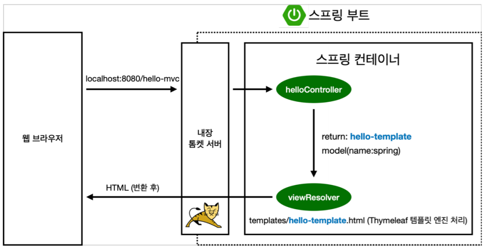

## Ch4. 스프링 빈과 의존관계
- ### 스프링 빈을 등록하고, 의존관계 설정하기
    - 스프링 빈 등록 방법 
        - 컴포넌트 스캔과 자동 의존관계 설정
        - 자바 코드로 직접 스프링 빈 등록하기
    - ### 컴포넌트 스캔과 자동 의존관계 설정 
    - @Component annotation이 있으면 스프링 빈으로 자동 등록된다.
    - → @Component 를 포함하는 다음 annotation도 스프링 빈으로 자동 등록된가.
        - @Controller / @Service / @Repository
        - 각각 유일하게 하나만 등록한다. → 서로 공유함.
    - member 컨트롤러 
        - member 서비스와 member 리포지토리를 사용할 수 있도록 의존관계 추가
        - @Controller annotation
            - 스프링이 실행될때 해당 컨트롤러 객체를 생성하여 스프링에서 관리함
            - 컨트롤러에서 스프링 빈이 관리된다 라고 이야기 함

            
            - 모든 것을 스프링 컨테이너에 등록 하고 → 스프링 컨테이너에서 받아 쓰도록 한다.
            - **컴포넌트 스캔과 자동 의존관계 설정 방식**
            - @Autowired
                 - 생성자에 붙이는 annotation
                 -  스프링이 컨테이너에 있는 서비스를 컨트롤러와 연결시켜줌 - **dependency injection - 의존성 주입**
                 - 서비스는 순수한 JAVA 클래스이기 때문에 스프링이 인식 못함
                     - 서비스에 @service annotation 추가
                     - 리포지토리 구현체에 @repository annotation 추가
                 - 서비스와 리포지 토리 연결을 위해 
                     - 서비스 생성자에 @Autowired annotation 추가
                     - **스프링 빈 등록**

    - ### 자바 코드로 직접 스프링 빈 등록하기
        - @Configuration annotation
            - @Bean - 스프링 빈 등록
            - 서비스와 스프링 빈에 등록된 repository를 연결함
            - 컨트롤러는 컴포넌트 스캔 방식으로 자동 의존 관계 설정
            
- ### Dependency Injection
    - 필드 주입 / setter 주입 / 생성자 주입 → 3가지 방법이 있읍
    - 필드 주입
        - 필드에 @Autowired annotation 추가
        - 추천되지 않음. - 수정 불가 하여
    - 생성자 주입
        - 생성자에 @Autowired annotation 추가
        - 파라미터로 넘어온 것과 연결 됨.
        - 추천됨
            - **의존관계가 서비스 실행 도중 동적으로 변하는 경우가 거의 없음.**
    - setter 주입
        - setter에 @Autowired annotation 추가
        - 단점 - public이기 때문에 중간에 변경 가능하여 - 문제 발생 가능
        
- ### 특징
    - 상황에 따라 구현 클래스를 변경해야 하면 설정을 통해 스프링 빈으로 등록한다.
        - 직접 스프링 빈을 등록 할 시 → 간단하세 상황에 따라 변경 등록 가능
    - 스프링 컨테이너에 올라 간 것들만 @Autowired 동작됨
