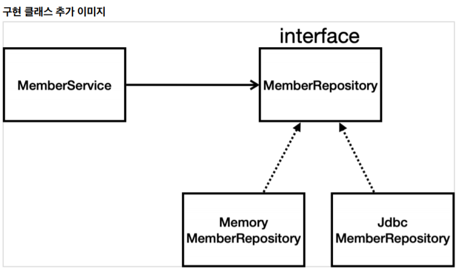
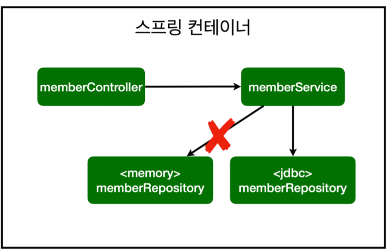
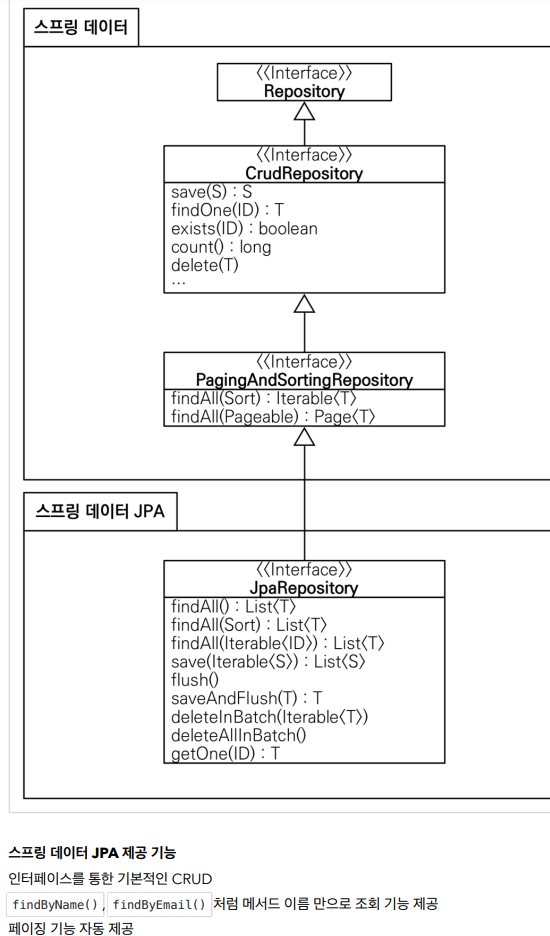

## Ch6. 스프링 DB 접근 기술
- ### H2 데이터베이스 설치
    - 개발이나 테스트 용도로 가볍고 편리한 DB
    - 웹 화면 제공
    - 실행 방법
        - h2.sh 파일 실행 
        - h2.bat 파일 실행
    - 데이터 베이스 파일 생성
        - jdbc:h2:~/test (최초 한번) - 파일 직접 접근
        - ~/test.mv.db 파일 생성 확인
        - 이후부터는 jdbc:h2:tcp://localhost/~/test 이렇게 접속
            - 소켓을 통해서 접근
            - 여러 군데에서 접근 가능 - 충돌 방지
    - 테이블 생성
        - 쿼리문 작성 후 실행
        - Long - bigint (자료형)
        - generated by default as identity
            - Null 값 이면 자동으로 DB가 값을 채워줌
            - repository 의 sequence 와 같은 개념
    - sql 파일 관리 
        - 프로젝트 폴더에 sql 폴더 별도 생성 후 sql 문 관리

- ### 순수 JDBC
    - 과거의 방식 요즘에는 안쓰임
    - 환경 설정
        - build.gradle 파일에 jdbc, h2 데이터 베이스 관련 라이브러리 추가
        - application.properties에 스프링 부트 데이터베이스 연결 설정 추가
    - repository에 JdbcMemberRepository class 생성 및 MemberRepository interface 구현 시작
    - SpringConfig
        - MemoryMemberRepository → JdbcMemberRpository 로 변경
    - 스프링을 사용하는 이유 - **객체 지향의 특성인 다형성 활용**
        - 구현체 바꿔끼기 가능
        - 스프링 컨테이너가 지원
            - Dependency Injection 을 활용하여 
        - 애플리케이션 조립하는 코드만 수정 하여도 완성 가능

    - SOLID 방식
        - OCP(Open-closed Principle)
            - 개방 폐쇄원칙
            - 확장에는 열려있고, 수정,변경에는 닫혀있다.
        - 스프링의 DI(Dependencies Injection)을 사용하면 **기존 코드를 전혀 손대지 않고, 설정만으로 구현 클래스를 변경** 할 수 있다.
        
- ### 스프링 통합 테스트
    - 스프링 컨테이너와 DB까지 연결한 통합 테스트
    - 서비스 테스트 코드
        - @SpringBootTest
            - 스프링 컨테이너와 테스트를 함께 실행함.
        - @Transactional
            - 테스트 시작 전에 트랜잭션을 시작 
            - 테스트완료 후 항상 RollBack
            - DB에 데이터가 남지 않으므로 다음 테스트에 영향을 주지 않음.
    - 테스트 시 테스트용 DB를 따로 구축
    - 반복 테스트를 위한 DB 처리
        - @Transactional 이용
            - 테스트 이후 RollBack → commit 이 안됨
    - 순수한 단위 테스트가 훨씬 더 좋은 테스트 일 수 있다.
        - 스프링 관여 없이 하는 테스트 → 기능별로 각각의 테스트 수행

- ### 스프링 JdbcTemplate
    - 환경 설정
        - 순수 Jdbc와 동일
    - 반복코드 제거 / SQL문은 그대로 작성 필요
    - jdbcTemplate 객체 생성
        - 데이터 소스와 연결 
        - 생성자 에 @Autowired 
        - jdbcTemplate = new JdbcTemplate(dataSource);
        - 생성자가 하나 일떄 autowired 생략 가능
    - RowMapper 생성
        - 쿼리 결과를 매핑 하는 곳
        - alt + enter → 람다 식으로 변경 가능
    - 적용
        - SpringConfig
            - MemberRepository
                - return new JdbcTemplateMemberRepository(dataSource);
                
- ### JPA
    - 기존 반복 코드 및 SQL 코드를 줄여줌
    - SQL과 데이터 중심의 설계에서 → 객체 중심 설계로 패러다임 전환
    - 개발 생산성을 크게 높여줌
    - 라이브러리 추가
        - build.gradle
            - implementation 'org.springframework.boot:spring-boot-starter-data-jpa'
            - jdbc 포함 함으로 jdbc 는 주석 처리
        - application-properties
            - spring.jpa.show-sql=true
            - spring.jpa.hibernate.ddl-auto 
                - DDL문장 자동 생성
    - ORM 기술
        - Objective Relational Mapping
    - Mapping
        - Member 에 @Entiry
        - PK 추가 → @Id, @GeneratedValue
    - repository
        - EntityManager 객체 추가
        - 생성자에 EntityManager 추가
    - JPQL 쿼리 언어
        - 객체(MemberEntity) 대상으로 쿼리 언어
        - select 객체 from 객체
    - transaction
        - JPA 사용을 위해 꼭 필요
        - MemberService에 @Transactional 추가
    - 적용
        - SpringConfig
            - EntityManager 객체 추가
            - 생성자에 EntityManager 추가
            - MemberRepository
                - return  
                
- ### 스프링 데이터 JPA
    - 인터페이스만으로 개발 완료 가능
    - 반복 개발해온 기본 CRUD 기능도 스프링 데이터 JPA가 모두 제공
    - 단순 반복 개발 코드들이 확연히 줄어듬
    - 핵심 비즈니스 로직 개발에 집중할 수 있게 해줌
    - 주의
        - JPA를 먼저 학습 후 스프링 데이터 JPA를 학습하는 것 을 추천
    - JPA 설정 그대로 사용 하면 됨.
    - 코드
        - repository
            - SpringDataJpaMemberRepository interface 생성 후 JpaRepository, MemberRepository extends
            - @Override → Optional<Member findByName(String Name);
        - 스프링 데이터 JPA 가 JpaRepository를 갖고있는 interface를 자동으로 구현체를 만들고 스프링 빈에 자동으로 등록해줌.
    - 적용
        - SpringConfig
            - MemberRepository 객체 생성 및 생성자에 의존성 주입
    

    
    - native 쿼리문 도 사용 가능
