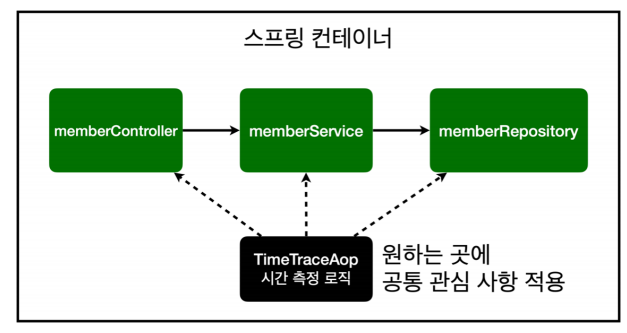
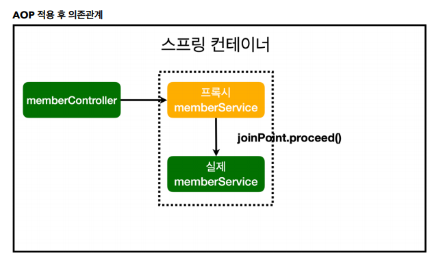
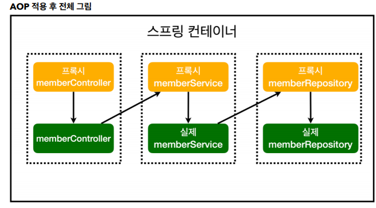

### Ch7.AOP
- ### AOP가 필요한 상황
    - 모든 메소드의 호출 시간을 측정하고 싶다면?
        - 각 메소드 별로 시간측정 로직을 넣어야 하는가?
            - 문제
                - 시간 측정은 핵심 관심 사항 이 아닌 공통 관심 사항이다.
                - 시간 측정 로직과 핵심 비즌스 로직이 섞여 있으면 → 유지보수가 어려움

- ### AOP 적용
    - AOP : Aspected Oriented Programming
    - 공통 관심 사항 VS 핵심 관심 사항 분리
    

    

